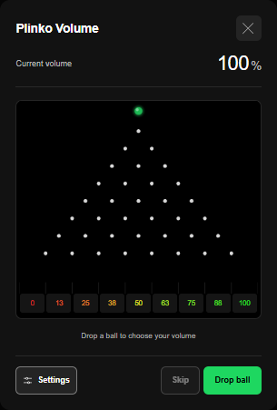
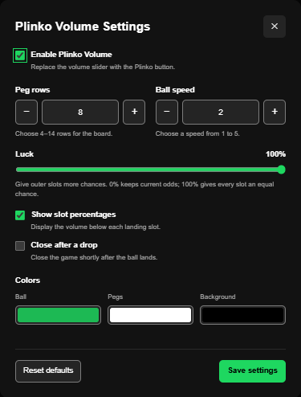

# Plinko Volume

Choose your Spotify volume with a Plinko drop. Each landing slot sets the volume to its displayed percentage. The Plinko button shows the current volume, including changes made outside the game.



## Features

- Drop a ball by clicking the board, pressing **Enter** or **Space**, or using **Drop ball**.
- Use **Skip** to finish the current drop immediately.
- See your volume percentage beside the Plinko button.
- Choose 4–14 peg rows and a ball speed from 1–5.
- Adjust **Luck** from 0–100% to give outer slots more chances.
- Customize the ball, peg, and background colors.
- Show or hide slot percentages, and optionally close the game after a drop.
- Enable or disable the replacement controls from the profile menu.

The game uses Spotify's interface colors around the black board, with raised gray controls, a green Drop ball button, and the original red-to-green slot percentages. Open **Settings** directly from the game footer.

At **0% Luck**, each drop independently chooses left or right with a 50% chance at every peg row, following [Stake's documented Plinko direction model](https://stake.com/provably-fair/game-events). Middle slots occur more often than outer slots. With eight rows, 50% volume has a 27.34% chance; 0% and 100% each have a 0.39% chance.

**Luck** starts at 0%. Increasing it mixes those odds with equal chances for every slot, keeping the left and right sides balanced. At 50% Luck the two distributions are mixed equally; at 100% Luck every slot is equally likely. Luck changes the odds, not the displayed volume values, and does not guarantee an outcome. Speed changes only the animation duration; **Skip** finishes the chosen path without changing its result.

Board and ball graphics are cached during a game. Closing the game stops its animation and clears its close timer.

## Marketplace installation

1. Install **Plinko Volume** from Spicetify Marketplace and reload Spotify.
2. Open your profile menu and choose **Plinko Volume Settings**.
3. Turn on **Enable Plinko Volume** and click **Save settings**.
4. Click the Plinko button beside the volume percentage to play.

The extension starts disabled on a fresh installation. Disabling it restores Spotify's normal volume controls.

## Manual installation

1. Download [gamblevolume.js](https://raw.githubusercontent.com/A2R14N/spicetify-extensions/main/gamblevolume/gamblevolume.js).
2. Copy it into your Spicetify extensions directory. Find that directory with `spicetify path -e root`.
3. Run:

   ```sh
   spicetify config extensions gamblevolume.js
   spicetify apply
   ```

4. Enable the extension through **Plinko Volume Settings** in the profile menu.

## Settings

Settings are saved locally and shared across Spotify profiles. **Reset** restores the defaults and disables the replacement controls.

The settings dialog follows Spotify's interface colors, with raised gray controls, green accents, number steppers, labeled checkboxes, and color swatches. Click **Save settings** to apply changes. Press **Escape** or click outside the dialog to close it.



Tested in Spotify **1.3.3.264** with Spicetify **2.45.3**.
